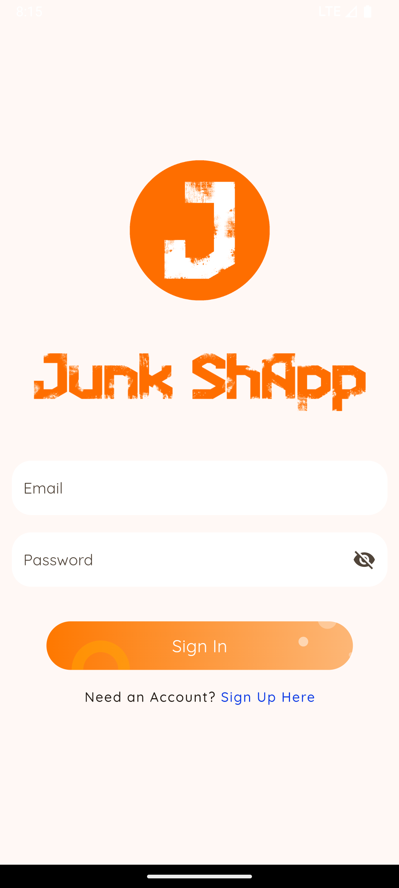
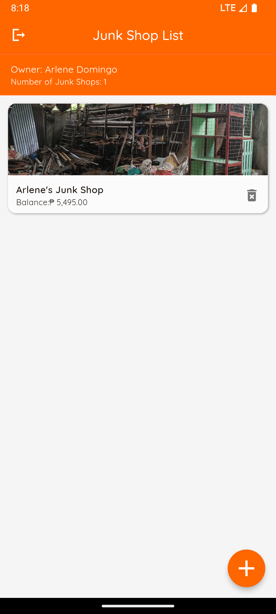
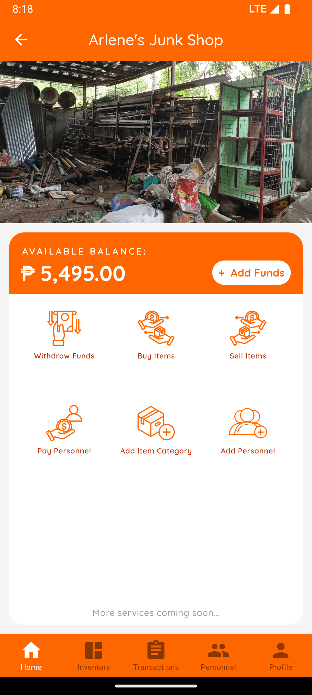
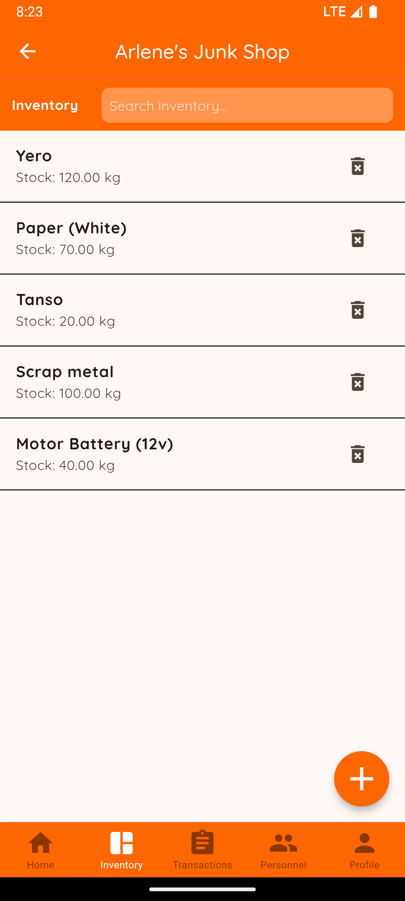
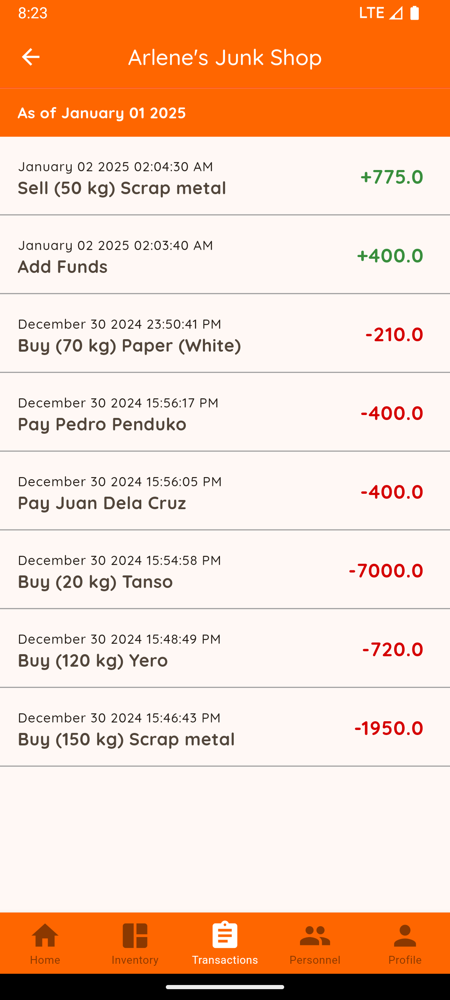
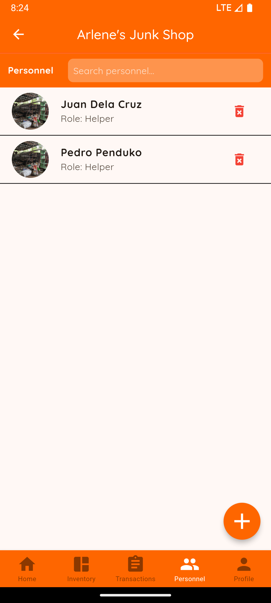

<!-- PROJECT LOGO -->
<br />
<div align="center">
  <a href="https://github.com/MoriheiArieta/junk-shapp/blob/main/README.md">
    
  </a>

  <h3 align="center">Junk ShApp</h3>

  <p align="center">
    Junk Shop Inventory and Personnel Management Mobile Application
    <br />
    <a href="https://drive.google.com/file/d/1MiVpsTrk2kulOLPfPt1Cfj7icrOpzKEt/view?usp=sharing">View Demo</a>
  </p>
</div>

<!-- ABOUT THE PROJECT -->
## About The Project
<div align="center">
  
</div>

An initiative to modernize solid waste management through digitizing common business processes for junk shop owners. 

### Features:
* Admin/Owner Account Registration and Authentication
* Multiple Junk Shop Management
* Inventory Management
* Transactions Tracking
* Personnel Record Management

### Built With
* [![Flutter][Flutter.dev]][Flutter-url]
* [![Dart][Dart.dev]][Dart-url]
* [![Firebase][Firebase.google]][Firebase-url]

<!-- GETTING STARTED -->
## Getting Started

### Prerequisites
* Make sure to have Flutter and Firebase installed correctly on your chosen IDE and device.

    <b>OR</b>

* An emulator or a physical mobile device.

    <b>OR</b>

* Download APK **[HERE](https://drive.google.com/file/d/1aXRdhIK7oT20xPNhOl0Hyy3lGCIwbpEg/view?usp=drive_link)**
### Installation
* Get all dependencies and packages.
```sh
flutter pub get
```
* Run on an emulator or a physical mobile device (enable USB debugging).
```sh
flutter run
```
  **OR**

* Install [APK](https://drive.google.com/file/d/1aXRdhIK7oT20xPNhOl0Hyy3lGCIwbpEg/view?usp=drive_link) on a physical mobile device.
    
<!-- SCREENSHOTS -->
## Screenshots
<div align="center">
  <table>
    <tr>
      <td align="center">
        
        <br />
        <b>Login Screen</b>
      </td>
      <td align="center">
        
        <br />
        <b>Junk Shop List</b>
      </td>
      <td align="center">
        
        <br />
        <b>Home</b>
      </td>
    </tr>
    <tr>
      <td align="center">
        
        <br />
        <b>Inventory</b>
      </td>
      <td align="center">
        
        <br />
        <b>Transactions</b>
      </td>
      <td align="center">
        
        <br />
        <b>Personnel</b>
      </td>
    </tr>
  </table>
</div>


<!-- MARKDOWN LINKS & IMAGES -->
[Flutter.dev]: https://img.shields.io/badge/Flutter-02569B?style=for-the-badge&logo=flutter&logoColor=white
[Flutter-url]: https://flutter.dev/
[Dart.dev]: https://img.shields.io/badge/Dart-0175C2?style=for-the-badge&logo=dart&logoColor=white
[Dart-url]: https://dart.dev/
[Firebase.google]: https://img.shields.io/badge/Firebase-DD2C00?style=for-the-badge&logo=firebase&logoColor=white
[Firebase-url]: https://firebase.google.com/


